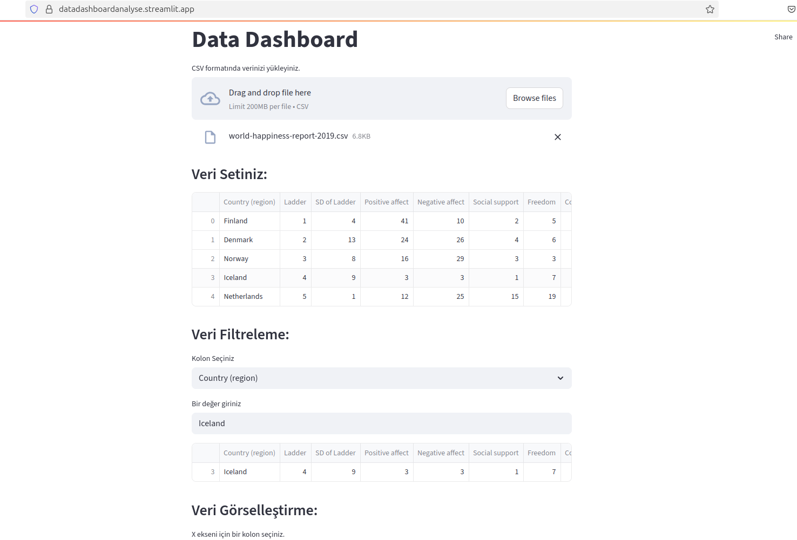

# Streamlit Veri Panosu

Bu depo, Streamlit kullanarak oluşturulmuş etkileşimli bir veri panosu uygulamasını içermektedir. Çeşitli veri görselleştirmeleri ve analiz araçları sunarak verilerinizi anlamanıza yardımcı olur.

## Giriş

Uygulamanın ana ekranının bir önizlemesi aşağıdadır:

## Kurulum

Bu uygulamayı yerel makinenizde çalıştırmak için aşağıdaki adımları izleyin:

1.  **Git'i kurun:** Eğer sisteminizde Git kurulu değilse, [Git'in resmi web sitesinden](https://git-scm.com/) indirip kurun.

2.  **Depoyu klonlayın:** Terminal veya komut istemcisini açın ve aşağıdaki komutu kullanarak bu depoyu yerel makinenize klonlayın:

    \`\`\`bash
    git clone https://github.com/mustafaemirata/Streamlit_Data_Dashboard.git
    cd Streamlit_Data_Dashboard
    \`\`\`

3.  **Python'ı kurun:** Uygulama Python ile geliştirilmiştir. Sisteminizde Python 3.6 veya üzeri bir sürümün kurulu olduğundan emin olun. Python'ı [resmi web sitesinden](https://www.python.org/downloads/) indirebilirsiniz.

4.  **Gerekli kütüphaneleri kurun:** Depo dizinine geçtikten sonra, gerekli Python kütüphanelerini yüklemek için aşağıdaki komutu çalıştırın:

    \`\`\`bash
    pip install -r requirements.txt
    \`\`\`

    `requirements.txt` dosyası, uygulamanın ihtiyaç duyduğu tüm kütüphanelerin bir listesini içerir (örneğin, Streamlit, Pandas, Matplotlib, vb.).

## Kullanım

Uygulamayı çalıştırmak için aşağıdaki adımı izleyin:

1.  Terminal veya komut istemcisinde depo dizininde olduğunuzdan emin olun.

2.  Aşağıdaki komutu çalıştırın:

    \`\`\`bash
    streamlit run app.py
    \`\`\`

    Bu komut, Streamlit uygulamasını başlatacak ve genellikle yerel web tarayıcınızda otomatik olarak yeni bir sekmede açılacaktır. Eğer açılmazsa, terminalde belirtilen adresi (genellikle `http://localhost:8501`) tarayıcınıza yapıştırarak uygulamaya erişebilirsiniz.

## Uygulama Hakkında

Bu Streamlit panosu, [kullanım amacına dair kısa bir açıklama veya uygulamanın ana özelliklerini vurgulayan bilgiler buraya eklenebilir]. Verilerinizi etkileşimli grafikler ve tablolar aracılığıyla görselleştirmenize ve analiz etmenize olanak tanır.

## Katkıda Bulunma

Bu projeye katkıda bulunmak isterseniz, lütfen aşağıdaki adımları izleyin:

1.  Bu depoyu forklayın.
2.  Yeni bir dal oluşturun: `git checkout -b ozellik/yeni-ozellik`
3.  Değişikliklerinizi yapın ve commit edin: `git commit -m "Yeni özellik eklendi"`
4.  Değişikliklerinizi ana depoya push edin: `git push origin ozellik/yeni-ozellik`
5.  Bir Pull Request oluşturun.

## Lisans

Bu proje [Lisans Adı] altında lisanslanmıştır. Daha fazla bilgi için lütfen [LİSANS](https://choosealicense.com/) adresini ziyaret edin veya bu depodaki ilgili lisans dosyasını inceleyin.
